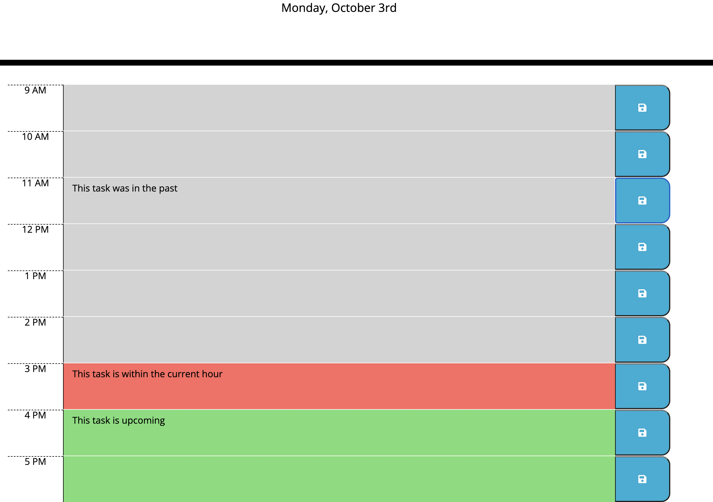

# Work Day Scheduler

## Description
This is a simple scheduler for the standard 9-5 work day. Todays date is displayed at the top of the page. You can type in tasks for each hour and save it so that if you return to the page, it will still be there. The task boxes color indicates whether that task is in the past, current or future hour. 

## screenshot

## Link

https://jeremybukofzer.github.io/work-day-scheduler/